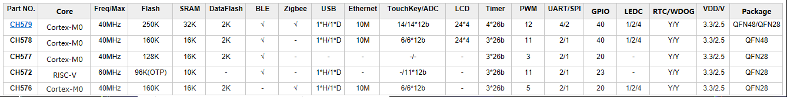

# [CH57x单片机](https://github.com/sochub/CH57)

 
####  qitas@qitas.cn

#### 父级：[WCH](https://github.com/sochub/WCH) 
#### 归属：[CM0](https://github.com/sochub/CM0) 

## [描述](https://github.com/sochub/CH57/wiki) 

CH57x系列单片机是WCH推出的32位低功耗无线通信系列MCU，该系列运行频率在40MHz，包括的主要特殊功能有：BLE / Zigbee / USB / Ethernet / Touchkey，不同的型号对应不同的规格

 

### [收录产品](https://github.com/sochub/CH57)

- [CH579](https://github.com/sochub/CH579) 

- [CH578](https://github.com/sochub/CH578) 

- [CH577](https://github.com/sochub/CH577) 

- [CH576](https://github.com/sochub/CH576) 

#### [相似产品](https://github.com/sochub/CH57)

- [CC2541](https://github.com/sochub/CC2541)
- [CC2530](https://github.com/sochub/CC2530)  
- [NRF51](https://github.com/sochub/NRF51) 
- [NRF52](https://github.com/sochub/NRF52) 

#### [姊妹产品](https://github.com/sochub/WCH)

- [CH56](https://github.com/sochub/CH56)
- [WCH-8051](https://github.com/sochub/WCH-8051)  

###  [SoC开发平台](http://www.qitas.cn)   
