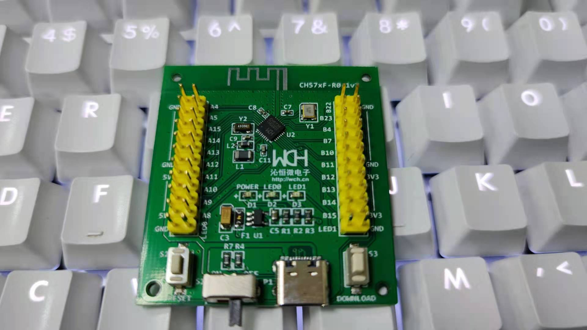

# [CH573](https://github.com/SoCXin/CH573)

* [WCH](http://www.wch.cn/)：[RISC-V3A](https://github.com/SoCXin/RISC-V)
* [L2R2](https://github.com/SoCXin/Level)：20 MHz

## [简介](https://github.com/SoCXin/CH573/wiki)

[CH573](https://github.com/SoCXin/CH573) 采用32位RISC-V3A内核，最高60MHz系统主频，支持RV32 IMAC指令集，支持硬件乘法和除法，片上集成BLE模块、全速USB主从控制器、SPI、4个串口、ADC、触摸按键检测模块、RTC等丰富的外设资源。

内置18K SRAM，512K Flash ROM，支持ICP、ISP和IAP，集成2.4GHz RF收发器和基带及链路控制，提高优化的协议栈和应用层API，支持组网，支持OAT无线升级

提供4组26位定时器，支持捕捉/采样，支持4路26位PWM输出，支持6路8位PWM输出，提供8通道12位ADC模数转换器，支持8通道触摸按键

提供20个GPIO，其中4个支持5V信号输入，所有GPIO支持中断和唤醒功能，内置温度传感器, 内置电池电压低压监控，支持3.3V和2.5V电源，0dBm发送功率时电流为3mA，多种低功耗模式：Idle，Halt, Sleep, Shutdowm，最低电流0.3uA

#### 关键特性

* SPI x 2 + UART x 4 (16C550/6Mbps)
* BLE 4.2
* USB H/D
* 内置实时时钟RTC，支持定时和触发两种模式
* 支持2.1V～3.6V, 内置DC/DC转换

### [资源收录](https://github.com/SoCXin)

* [参考资源](src/)
* [参考文档](docs/)
* [参考工程](project/)
* [入门文档](https://docs.soc.xin/CH573)

### [选型建议](https://github.com/SoCXin)

[CH573](https://github.com/SoCXin/CH573) 是一款非常具有性价比的BLE SoC产品，可以应用于需要无线通信和USB通信的领域。

* QFN28 (4*4mm)
* QFN32 (4*4mm)

CH571 基于 CH573 简化，去掉了 USB host 主机和触摸按键检测模块、8 位 PWM 模块和两个串口，FlashROM 总容量仅 256KB，ADC 不支持 DMA，只支持 2.3V 以上电源电压。

#### 相关开发板

### [探索芯世界 www.SoC.xin](http://www.SoC.Xin)
